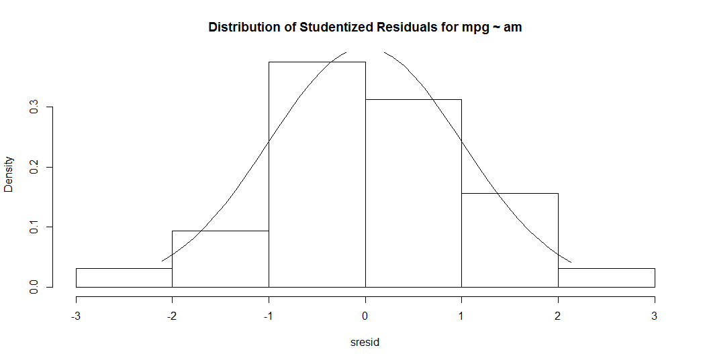
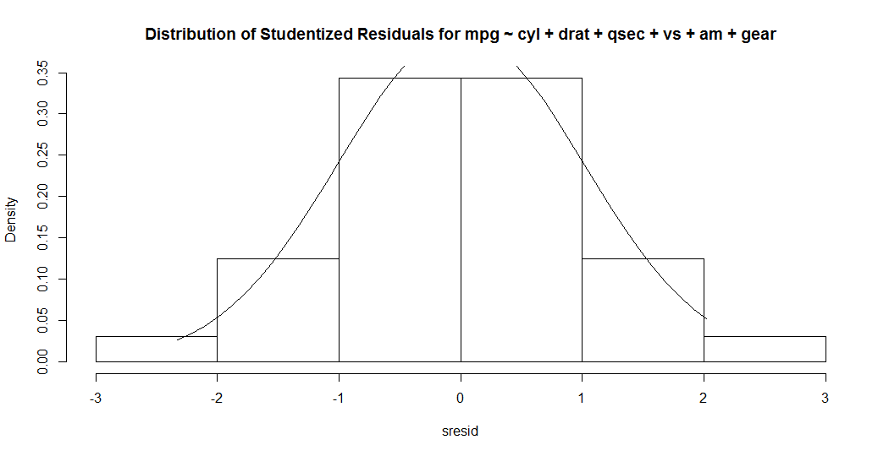
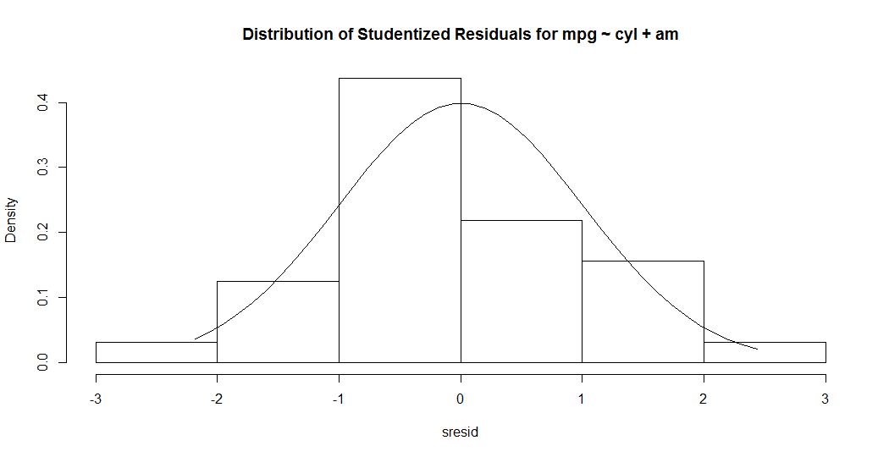
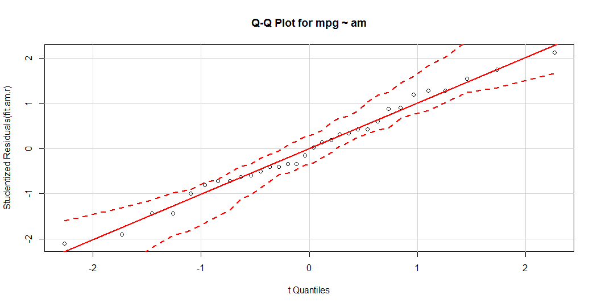
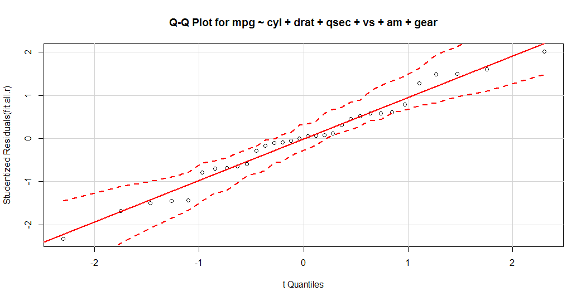
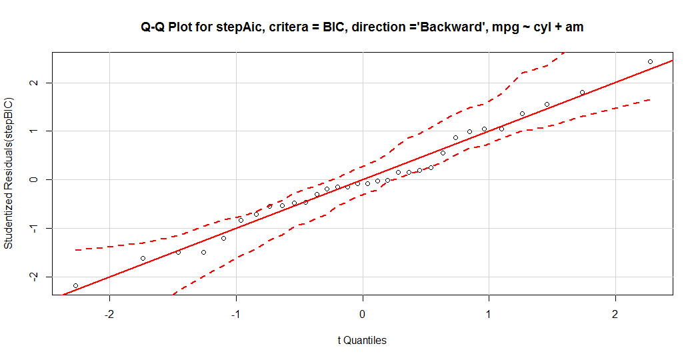
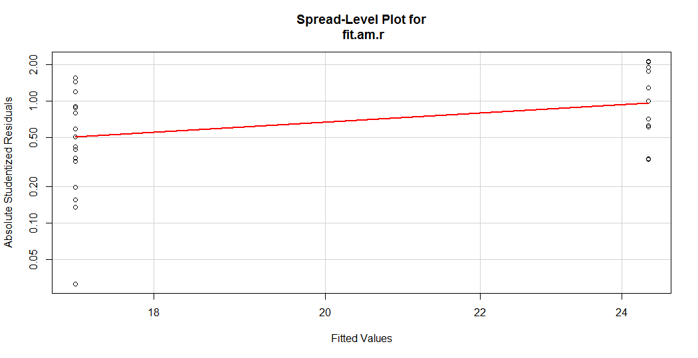
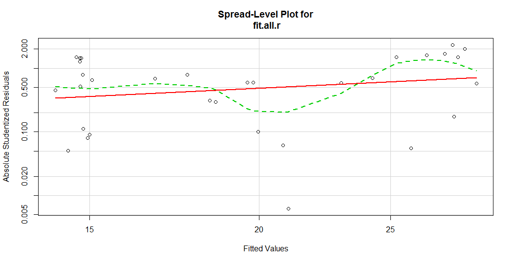

```{r setup, include=FALSE}
knitr::opts_chunk$set(echo = TRUE)
```

## Executive Summary
The project goal was to determine if there is a quantifiable effect of transmission type (automatic or manual) on fuel efficiency.  Data from a Motor Trend dataset was explored, highly correlated predictors removed, data tidied and different models investigated. 

There is a relationship between fuel efficiency and transmissiong type, however, that relationship is weak, accounting for only 34% of the variability in fuel efficiency (mpg). Two other models are discussed that have higher adjusted R-squared values.  One model finds the number of cylinders and transmission type account for .  The third model involves more variables (number of cylinders, rear axle ratio, time to cover 1/4 mile, engine type, transmission type and number of forward gears.).  That model accounted for 

All models were evaluated against a record set with highly correlated variables removed.

## Data Exploration
The dataset, mtcars (Motor Trend Cars), is from a 1974 Motor Trend US issue.  Fuel efficiency and 10 other vehicle attributes were collected for 32 cars in 1973-1974. Each line of data in the mtcars dataframe represents one model of a car with each column representing one attribute of that car as shown in Table A-1 in the Appendix.

19 of the 32 records are foreign cars (1 Ferrari, 2 Fiats, 1 Honda, 1 Lotus, 1 Maserati, 2 Mazdas, 7 Mercedes, 1 Porsche, 2 Toyotas and 1 Volvo). Figure 1 shows scatter plots of MPG data versus each of the other variables.  There is a fair amount of curvative in the possible response of MPG to different car attributes. The most fuel efficient car is the Toyota Corolla at 33.9 mpg. The least fuel efficient cars are the Cadillac Fleetwood and Lincoln Continental at 10.4 mpg.


## Tidying Data
Since the question is about the effect of transmission type on fuel efficiency, the transmission type variable (AM) was recoded as 0 = Automatic and 1 = Manual. The variables Transmission Type (am), Number of Cylinders (cyl), Engine Type(vs) and Number of Forward Gears (gear), while numeric, are categorical and were converted to factors.  All other variables were not altered.  Variable names, while not memorable, were left as abbreviations.

Highly correlated predictors lead to regression coefficients that depend on other included predictors, standard errors increase which leads to wider confidence interval and less precise slope estimates and marginal model improvement due to an added variable depends on other variables in the model. The findCorrelation function in the caret package was used to evaluate a correlation matrix (Table A-2) of the numerical variables.  Gross HorsePower (hp), Displacement (disp), Weight (wt) and Number of Carburetors (carb).  The reduced data frame includes the following data elements: model, Miles Per Gallon (mpg), Number of Cylinders (cyl), Rear Axle Ratio (drat), Quarter Mile Time (qsec), Engine Type (vs), Transmission Type (am) and Number of Gears gear).

## Analysis
Two preliminary linear models Transmission Type only (MPG ~ AM) and all remaining variables (MPG ~ .) were constructed. The simplest model, MPG ~ AM, has each term as significant but an adjusted R-squared of 0.3385.  The more complicated model (MPG ~ .), that includes all remaining variables has an adjuste R-squared of 0.7026 but no term is very significant.

Step wise regresssion (stepAIC from the MASS package) was used to find combinations of more significant terms from the MPG ~ . model. Akaike information criterion (AIC) was used as the criteria for forward, backward and both direction executions of the stepAIC function. Bayesian information criterion (BIC) with log(32) degrees of freedom was used as the criteria for the last step wise regression.  

The resulting models were then diagnostically evaluated for multicollinearity (VIF), autocorrelation (Durbin-Watson) ,Shapiro-Wilk normality of residuals, heteroscedasticity, Non-constant Variance Score.  For each of the following models, there were no concerns resulting from the evaluations.  Eliminating the variables with high correlations before creating models improved the results of the diagnostic tests.

The models tested are shown in the following table.

#### Table 1: Models evaluated.
<table border ="1">
<tr><th>Model</th><th>Adj. R-Squared</th><th>Formula</th><tr>
<tr><td>stepBack</td><td>0.7399</td><td>mpg ~ cyl + am</td><tr>
<tr><td>stepBoth</td><td>0.7399</td><td>mpg ~ cyl + am</td><tr>
<tr><td>stepFor</td><td>0.7026</td><td>mpg ~ cyl + drat + qsec + vs + am + gear</td><tr>
<tr><td>stepBIC</td><td>0.7399</td><td>mpg ~ cyl + am</td><tr>
<tr><td>fit.am.r</td><td>0.3385</td><td>mpg ~ am</td><tr>
<tr><td>fit.all.r</td><td>0.7026</td><td>mpg ~ cyl + drat + qsec + vs + am + gear</td><tr>
</table>
</br>
The most common model found, and the one with a marginally higher adjust R-squared of 0.7399, was the fuel efficiency as function of the number of cylinders and transmission type (mpg ~ cyl + am).

Figures 11-13 show plots of studentized residuals against a normal distribution. Figure 14-16 are Q-Q plots of studentized residuals for the three models discussed below. Figures 17-19, are spread level plots of the absolute studentized residuals against the fitted Values for the three Models.  All three collections indicate the studentized residuals are nearly normal in their distribution.


## Results

The original question was whether transmission type by itself was a good predictor of fuel efficiency.  The simplest model, MPG ~ AM had an adjusted R-squared of 0.3385.  That simple model only explains 34% of the variaton in the data. A still simple model of mpg ~ cyl + am had an adjusted R-Squared of 0.7399.  That is, it explains 74% of the variation.  A third model of mpg ~ cyl + drat + qsec + vs + am + gear explained 70% of the variability.

The following sections compare the three models.  The LL and UL columns indicate the upper and lower confidence interval limits for the 95% level.  The last column corresponds to the R significance codes:' <table border=0><tr><td>0</td><td>‘***’ = </td><td>0.001 </td><td>‘**’ = </td><td>0.01</td><td>‘*’ = </td><td>0.05</td><td>‘.’ = </td><td>0.1</td><td>‘ ’ = </td><td>1 = </td></tr></table>'


### Simple Model (mpg ~ am)
The following table shows the regression results for fuel efficiency effects due to transmission type.

#### Table 2: Simple Model of mpg vs am
<table border =1>
<tr><th></td><th>Estimate</th><th>Std. Error</th><th align="center">LL</th><th  align="center">UL</th><th>t value </th><th>Pr(>|t|)</th><th></th></tr>
<tr><td>Intercept)</td><td>17.15</td><td>1.13</td><td>14.85</td><td>19.44</td><td>15.25</td><td>1.13E-15</td><td>***<td></tr>
<tr><td>am1</td><td>7.25</td><td>1.76</td><td>3.64</td><td>10.85</td><td>4.11</td><td>0.000285</td><td>***<td></tr>
</table>

</br>   
The coefficient for manual transmission (am1), shows that fuel efficiency is 7.24 miles per gallon higher than cars with automatic transmissions (am0). However, this simple model has a low adjusted R-squared value of 0.3385.  That is, transmission type differences account for only 34% of the variation in fuel efficiency.  For comparison, the most fuel efficient car in, the Toyota Corolla, is a manual transmission and the least efficient cars, the Cadillac Fleetwood and Lincoln Continental, are automatic transmission.


### Highest Adjusted R-Squared Model (mpg ~ cyl + am)
The following table shows the regression results for fuel efficiency effects due to the number of cylinders and transmission type.

#### Table 3: Model with two terms (mpg ~ cyl + am)
<table border =1>
<tr><th></td><th>Estimate</th><th>Std. Error</th><th align="center">LL</th><th  align="center">UL</th><th>t value </th><th>Pr(>|t|)</th><th></th></tr>
<tr><td>(Intercept)</td><td>24.80</td><td>1.32</td><td>22.09</td><td>27.51</td><td>18.75</td><td>&lt; 2.00E-16</td><td>***</td></tr>
<tr><td>cyl6</td><td>-6.16</td><td>1.54</td><td>-9.30</td><td>-3.01</td><td>-4.01</td><td>0.000411</td><td>***</td></tr>
<tr><td>cyl8</td><td>-10.07</td><td>1.45</td><td>-13.04</td><td>-7.09</td><td>-6.93</td><td>1.55E-07</td><td>***</td></tr>
<tr><td>am1</td><td>2.56</td><td>1.30</td><td>-0.10</td><td>5.22</td><td>1.97</td><td>0.058457</td><td>.</td></tr>
</table>
</br>
Three variations of step wise regression found this model with an adjusted R-Squared of 0.7399.  What does not show in the model is the cyl4 (Number of cylinders = 4) variable.  Moving from 4 to 6 cylinders drops fuel efficiency by 6.16 miles per gallon and moving to 8 cylinders drops fuel efficiency by 10.07 miles per gallon while using a manual transmission (am1) increases fule efficiency by 2.56 miles per gallon.  Transmission type as a variable has low significance.  The Toyota Corolla has 4 cylinders and a manual transmission and the Cadillac Fleetwood and Lincoln Continental both have 8 cylinders and automatic transmissions.

### Second Highest Adjusted R-Squared Model (mpg ~ cyl + drat + qsec + vs + am + gear)
This model is included in the results since it was the starting model for step wise regression and had an adjusted R-squared of 0.7026.  Unlike the previous model, no variable was considered significant.  Increasing the number of cylinders and forward gears descreases fuel efficiency (), drat increases MPG by 1.4201, qsec just a little bit 0.3208 while engine type (straight vs VB) increases mileage by 1.58 MPG and manual transmission (am1) by 4.65 MPG.


#### Table 4: Complex Model ( mpg ~ cyl + drat + qsec + vs + am + gear)
<table border =1>
<tr><th></th><th>Estimate</th><th>Std. Error</th><th align="center">LL</th><th  align="center">UL</th>&nbsp;&nbsp;&nbsp;<th>t value </th><th>Pr(>|t|)</th><th></th></tr>
<tr><td>(Intercept)</td><td>11.99</td><td>21.35</td><td>-32.17</td><td>56.15</td><td>0.56</td><td>0.5797</td><td>&nbsp;</td><tr>
<tr><td>cyl6</td><td>-4.38</td><td>2.59</td><td>-9.74</td><td>0.98</td><td>-1.69</td><td>0.1044</td><td>&nbsp;</td><tr>
<tr><td>cyl8</td><td>-7.18</td><td>4.08</td><td>-15.63</td><td>1.27</td><td>-1.76</td><td>0.0921</td><td>&nbsp;.</td><tr>
<tr><td>drat</td><td>1.42</td><td>2.41</td><td>-3.56</td><td>6.40</td><td>0.59</td><td>0.5609</td><td>&nbsp;</td></tr>
<tr><td>qsec</td><td>0.32</td><td>0.84</td><td>-1.42</td><td>2.06</td><td>0.38</td><td>0.7059</td><td>&nbsp;</td><tr>
<tr><td>vs1</td><td>1.58</td><td>2.52</td><td>-3.62</td><td>6.79</td><td>0.63</td><td>0.5351</td><td>&nbsp;</td><tr>
<tr><td>amManual</td><td>4.65</td><td>2.62</td><td>-0.77</td><td>10.07</td><td>1.77</td><td>0.0893</td><td>&nbsp;.</td><tr>
<tr><td>gear4</td><td>-2.25</td><td>2.87</td><td>-8.19</td><td>3.70</td><td>-0.78</td><td>0.4424</td><td>&nbsp;</td><tr>
<tr><td>gear5</td><td>-2.41</td><td>3.03</td><td>-8.67</td><td>3.85</td><td>-0.80</td><td>0.4336</td><td>&nbsp;</td><tr>
</table>


</br>
While cyl8 and amManual have the lowest significance, there are some interesting points here in this model.  Rear axle ratios (drat) are associated with pickup (qsec) and engine revolutions per minute (RPMs).  A lower drat means quicker pickup but higher RPMs which means lower fuel efficiency.  Conversely, a higher drat means slower pickup, but lower engine RPMs and better fuel efficiency.  This shows in the data.  The Cadillac Fleetwood and Lincoln Continental have drats of 2.93 and 3.00 with qsec values of  17.98 and 17.82.  The more fuel efficient Toyota Corolla has a drat of 4.22 and a qsec of 19.9. Considering, the relationship between drat and qsec, it is surprising the variables were not consider correlated.

Four cylinder engines are often straight or inline (with the exception of the 4 cylinder Porsche 914-2 which has a Vee engine) while all the 8 cylinder engines are Vee engines. Automatic transmission 6 cylinder engines are Vee engines while the manual transmission 6 cylinder have straignt or inline.  While this model is not as simple as the MPG ~ AM or MPG ~ CYL + AM models, it includes many components directly related to fuel efficiency.


##Conclusions

In this data set vehicles achieve a fuel effiency of 7.2 miles per gallon more than automatic vehicles.  Transmission type, by itself, is a a poor predictor of fuel efficiency. The best predictors were a combination of the number of cylinders and transmission type.  A third model with more terms was not as explanatory as the cylinders and transmission type model but has other terms that do explain changes in fuel efficiency.

## Appendix


#### Table A-1: MTCars Data Elements
<table border = "1" cellpadding="20" style="padding-right: 40px;">
<tr><th align="left">Variable</th><th align="left">Data Type</th><th align="left">Description</th><th align="left">Levels</th></tr>
<tr><td>Model</td><td>character</td><td>Brand and model</td><td>%nbsp;</td></tr>
<tr><td>MPG</td><td>number</td><td>Miles/(US) gallon</td><td>Continuous</td></tr>
<tr><td>cyl</td><td>number</td><td>Number of cylinders</td><td>4, 6, 8</td></tr>
<tr><td>disp</td><td>number</td><td>Displacement (cu.in.)</td><td>Continuous</td></tr>
<tr><td>hp</td><td>number</td><td>Gross horsepower</td><td>52,62,65,66,91,93,95,97,105,109,110,113,123,150,175,180,205,215,230,245,264,335</td></tr>
<tr><td>drat</td><td>number</td><td>Rear axle ratio</td><td>Continuous</td></tr>
<tr><td>wt</td><td>number</td><td>Weight (lb/1000)</td><td>Continuous</td></tr>
<tr><td>qsec</td><td>number</td><td>1/4 mile time</td><td>Continuous</td></tr>
<tr><td>vs</td><td>number</td><td>Engine type</td><td>0 = vee engine, 1 = straight or inline engine</td></tr>
<tr><td>am</td><td>number</td><td>Transmission type</td><td>0 = automatic, 1 = manual</td></tr>
<tr><td>gear</td><td>number</td><td>Number of forward gears</td><td>3, 4, 5</td></tr>
<tr><td>carb</td><td>number</td><td>Number of carburetors</td><td>1, 2, 3, 4, 6, 8</td></tr>
</table>

#### Figures A1-A10:  MPG vs Attributes.  Automatic Transmission data are colored pink, while manual transmission data are colored teal.  
<table>
<tr><td align="center">MPG vs Displacement</td><td align="center">MPG vs Gross Horsepower</td><td align="center">MPG vs Rear Axle Ratio</td><tr>
<tr>
<td></td>
<td></td>
<td></td>
<tr>
<tr><td  align="center">MPG vs Weight</td><td align="center">MPG vs Time to 1/4 Mile</td><td align="center">MPG vs Number of Cylinders</td><tr>
<tr>
<td></td>
<td></td>
<td></td>
<tr>
<tr><td align="center">MPG vs Engine Type</td><td align="center">MPG vs Transmission Type</td><td align="center">MPG vs Number of Forward Gears</td><tr>
<tr>
<td></td>
<td></td>
<td></td>
<tr>
<tr><td>&nbsp;</td><td align="center">MPG vs Number of Carburetors</td><td>&nbsp;</td><tr>
<tr><td>&nbsp;</td><td></td><td>&nbsp;</td><tr>
</table>

#### Table A-2: Correlation Matrix for MTCars Variables.  Variables with values > 0.6 were removed.
<table border =1 cellpadding="10">
<tr> <th>  </th> <th> disp </th> <th> hp </th> <th> drat </th> <th> wt </th> <th> qsec </th> <th> carb </th>  </tr>
<tr> <td align="right"> disp </td> <td align="right"> 1.00 </td> <td align="right">  </td> <td align="right"> </td> <td align="right">  </td> <td align="right">  </td> <td align="right">  </td> </tr>
<tr> <td align="right"> hp </td> <td align="right"> 0.79 </td> <td align="right"> 1.00 </td> <td align="right">   </td> <td align="right">   </td> <td align="right">   </td> <td align="right">   </td> </tr>
<tr> <td align="right"> drat </td> <td align="right"> -0.71 </td> <td align="right"> -0.45 </td> <td align="right"> 1.00 </td> <td align="right">  </td> <td align="right">   </td> <td align="right">   </td> </tr>
<tr> <td align="right"> wt </td> <td align="right"> 0.89 </td> <td align="right"> 0.66 </td> <td align="right"> -0.71 </td> <td align="right"> 1.00 </td> <td align="right">  </td> <td align="right">  </td> </tr>
<tr> <td align="right"> qsec </td> <td align="right"> -0.43 </td> <td align="right"> -0.71 </td> <td align="right"> 0.09 </td> <td align="right"> -0.17 </td> <td align="right"> 1.00 </td> <td align="right">   </td> </tr>
<tr> <td align="right"> carb </td> <td align="right"> 0.39 </td> <td align="right"> 0.75 </td> <td align="right"> -0.09 </td> <td align="right"> 0.43 </td> <td align="right"> -0.66 </td> <td align="right"> 1.00 </td> </tr>
</table>


#### Figures A11-A13:  Distribution of Studentized Residuals for Three Models.  
<table>
<tr><td align="center">mpg ~ am</td><td align="center">mpg ~ cyl + drat + qsec + vs + am + gear</td><td align="center">mpg ~ cyl + am </td><tr>
<tr>
<td></td>
<td></td>
<td></td>
<tr>
</table>

#### Figures A14-A16:  Q-Q Plots of Studentized Residuals for Three Models.  
<table>
<tr><td align="center">mpg ~ am</td><td align="center">mpg ~ cyl + drat + qsec + vs + am + gear</td><td align="center">mpg ~ cyl + am </td><tr>
<tr>
<td></td>
<td></td>
<td></td>
<tr>
</table>

#### Figures A17-A19:  Spread Level Plots of Absolute Studentized Residuals vs Fitted Values for Three Models.  
<table>
<tr><td align="center">mpg ~ am</td><td align="center">mpg ~ cyl + drat + qsec + vs + am + gear</td><td align="center">mpg ~ cyl + am </td><tr>
<tr>
<td></td>
<td></td>
<td></td>
<tr>
</table>

## System Information

The analysis was run with the following software and hardware.

```{r}
sessionInfo()
```

The source code for this document and the analysis is stored in GitHub at https://github.com/wer61537/Regression_Models_Course_Project.  The R code is at 
https://github.com/wer61537/Regression_Models_Course_Project/blob/master/regr_transmission_mpg.R.  The Markdown document is at https://github.com/wer61537/Regression_Models_Course_Project/blob/master/regr_transmission_mpg.Rmd.